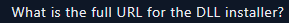

# LetsDefend\_CTF\_IcedIDMalwareFamily

<figure><figcaption></figcaption></figure>

This CTF starts by asking for the sha256 hash of the malspam attacmment. I will use VirusTotal to check the file hash.

<figure><figcaption></figcaption></figure>

<figure><figcaption></figcaption></figure>

I could have also pulled the hashes by using “sha256sum”(Linux) or “Get-FileHash -Algorithm SHA256″(Windows) commands to get the SHA256 hash of the files. However, the malspam attachment would disappear after a few seconds as it is running a macro to self delete itself. For this reason, I used VirusTotal to check the SHA256 hash value.

The next question asks the following:

<figure><figcaption></figcaption></figure>

For this question, I will use any.run and enter the SHA256 hash in the search.

I come out with a bunch of uploads&#x20;

<figure><figcaption></figcaption></figure>

I will select one and I get the following:

<figure><figcaption></figcaption></figure>

Now to answer the question, I will go to the child process of WINWORD.EXE which is explorer.exe and I can see the child process command line:

<figure><figcaption></figcaption></figure>

<figure><figcaption></figcaption></figure>

I could also use lolbas to check the files and when I download what malware can piggyback off the payload.

<figure><figcaption></figcaption></figure>

The next question asks for the SHA256 file hash of the HTML application. I will use VirusTotal for this

<figure><figcaption></figcaption></figure>

<figure><figcaption></figcaption></figure>

Next question:

<figure><figcaption></figcaption></figure>

I will use any.run for this again and check the DLL run method.

<figure><figcaption></figcaption></figure>

I will copy the Command Line:

<figure><figcaption></figcaption></figure>

<figure><figcaption></figcaption></figure>

The next question:

<figure><figcaption></figcaption></figure>

I will look at the image file dll installer on VirusTotal to get the SHA256 hash value:

<figure><figcaption></figcaption></figure>

<figure><figcaption></figcaption></figure>

Next question:

<figure><figcaption></figcaption></figure>

I use any.run again to find any DNS requests and find:

<figure><figcaption></figcaption></figure>

<figure><figcaption></figcaption></figure>

<figure><figcaption></figcaption></figure>

For this next question, I will use Wireshark to find the URL for the DLL installer.

I can find it in WireShark by looking at packet #6 which is the HTTP GET request.

<figure><figcaption></figcaption></figure>

It is lisstssed under the Hypertext Transfer Protocol under Request URI

<figure><figcaption></figcaption></figure>

<figure><figcaption></figcaption></figure>

The next question is asking for the two IP addresses identified as C2 servers.

With Wireshark, I will analyze the pcap file and filter out for DNS.

<figure><figcaption></figcaption></figure>

I can see that they tried to communicate with the C2 server several times and identified the following two IP addresses:

<figure><figcaption></figcaption></figure>

<figure><figcaption></figcaption></figure>

<figure><figcaption></figcaption></figure>

For this next questiuon, I noticed from before a few domains in the DNS list:

<figure><figcaption></figcaption></figure>

<figure><figcaption></figcaption></figure>

<figure><figcaption></figcaption></figure>

Again, I stay looking at the DNS protocol and see the two contacted by the installer DLL&#x20;

<figure><figcaption></figcaption></figure>

The aws.amazon.com and supplemmentik.top are the two domains that were contacted by the installer DLL after it was executed.

<figure><figcaption></figcaption></figure>

Next question is:

<figure><figcaption></figcaption></figure>

For this next question, I will add columns for ports:

<figure><figcaption></figcaption></figure>

Specifically, I will add the source port and destination port:

<figure><figcaption></figcaption></figure>

I will look for the Destination Port 8080 in my filter:

<figure><figcaption></figcaption></figure>

As highlighted, there are only two SYN requests, the destination ip address is 38.135.122.194 as listed:

<figure><figcaption></figcaption></figure>

Next question:

<figure><figcaption></figcaption></figure>

To answer this, I will check the scheduled task file:

<figure><figcaption></figcaption></figure>

I can find it near the bottom of the text file:

<figure><figcaption></figcaption></figure>

<figure><figcaption></figcaption></figure>

<figure><figcaption></figcaption></figure>

The above question, it is listed in the name of the challenge.

I could also use OSINT like the question asked and I can find it looking at the collectionBoxConst.jpg

<figure><figcaption></figcaption></figure>

The security vendors list it as Trojan IcedID family

<figure><figcaption></figcaption></figure>

Next question asks:

<figure><figcaption></figcaption></figure>

For this question, I do a google search and look for OSINT regarding this malware family.

<figure><figcaption></figcaption></figure>

To see the APT group name, I hover the "actor(s)" list.

<figure><figcaption></figcaption></figure>

The APT group that worked is TA551:

<figure><figcaption></figcaption></figure>

The last question is asking what is the MITRE ATT\&CK code for the initial access in this campaign?

The initial access was through email as the first question asked for malspam attachment which means it was delivered by mail. So I find that the MITRE ATT\&CK code is:

<figure><figcaption></figcaption></figure>

<figure><figcaption></figcaption></figure>

<figure><figcaption></figcaption></figure>
